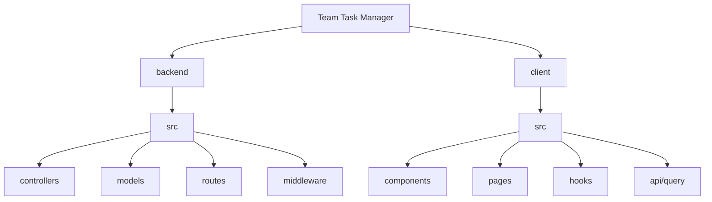

# 🚀 Team Task Manager

[](https://opensource.org/licenses/ISC)
[](https://react.dev/)
[](https://nodejs.org/)
[](https://www.mongodb.com/)
[](https://tailwindcss.com/)

A high-performance, full-stack collaborative task management platform built for modern teams. Streamline your project workflows, manage team roles, and track progress in real-time with a sleek, intuitive interface.

---

> [!NOTE]
> **Team Task Manager** is designed to bridge the gap between complex project management tools and simple to-do lists, providing exactly what teams need to stay productive without the bloat.

### ✨ Key Features

- **🔐 Enterprise-Grade Auth**: Secure session management using JWT (JSON Web Tokens), HttpOnly cookies, and Bcryptjs password hashing.
- **👨‍💼 Advanced Admin Suite**: Centralized dashboard for managing users, projects, and system-wide configurations.
- **📁 Dynamic Project Workspace**: Create, update, and manage projects with granular role-based access control (RBAC).
- **📋 Smart Task Tracking**: Multi-state task management (To Do, In Progress, Review, Done) with priority levels and deadlines.
- **🎨 Cutting-Edge UI**: A premium user experience crafted with React 19 and Tailwind CSS v4, featuring dark mode support and micro-interactions.
- **⚡ Optimized Data Sync**: Powered by TanStack Query (React Query) for seamless server-state synchronization and optimistic UI updates.

---

## 🛠️ Tech Stack

### Frontend
- **Framework**: [React 19](https://react.dev/) (Vite)
- **Styling**: [Tailwind CSS v4](https://tailwindcss.com/)
- **State Management**: [TanStack Query v5](https://tanstack.com/query)
- **Routing**: [React Router v7](https://reactrouter.com/)
- **Icons & UI**: [React Icons](https://react-icons.github.io/react-icons/), [React Hot Toast](https://react-hot-toast.com/)

### Backend
- **Runtime**: [Node.js](https://nodejs.org/)
- **Framework**: [Express 5](https://expressjs.com/)
- **Database**: [MongoDB](https://www.mongodb.com/) via [Mongoose](https://mongoosejs.com/)
- **Security**: JWT, Bcryptjs, CORS, Cookie-Parser
- **File Handling**: Multer (for future profile/attachment support)

---

## 🚀 Getting Started

### Prerequisites

- **Node.js** (v18 or higher)
- **npm** or **yarn**
- **MongoDB** instance (Local or MongoDB Atlas)

### 1. Clone & Install

```bash
# Clone the repository
git clone https://github.com/devajaypndey/Team-task-manager.git
cd Team-task-manager

# Install Backend dependencies
cd backend
npm install

# Install Frontend dependencies
cd ../client
npm install
```

### 2. Environment Configuration

Create a `.env` file in the `backend` directory:

```env
PORT=5000
MONGO_URL=your_mongodb_connection_string
JWT_SECRET=your_super_secret_key
NODE_ENV=development
```

### 3. Run the Application

#### Start Backend (from `/backend`)
```bash
npm run dev
```

#### Start Frontend (from `/client`)
```bash
npm run dev
```

---

## 🏗️ Architecture

### Folder Structure



### API Endpoints (v1)

| Method | Endpoint | Description | Auth |
| :--- | :--- | :--- | :--- |
| **POST** | `/api/auth/register` | User Registration | Public |
| **POST** | `/api/auth/login` | User Login | Public |
| **GET** | `/api/projects` | Get All User Projects | Private |
| **POST** | `/api/projects` | Create New Project | Private |
| **GET** | `/api/tasks` | Get Project Tasks | Private |
| **PUT** | `/api/tasks/:id` | Update Task Status | Private |
| **GET** | `/api/users` | List Users (Admin) | Admin |

---

## 📈 Roadmap

- [ ] 🔔 Real-time Notifications (Socket.io)
- [ ] 📊 Project Analytics & Charts
- [ ] 📎 File Attachments for Tasks
- [ ] 📅 Calendar View Integration
- [ ] 📱 Dedicated Mobile Application (React Native)

---

## 🤝 Contributing

Contributions are what make the open source community such an amazing place to learn, inspire, and create. Any contributions you make are **greatly appreciated**.

1. Fork the Project
2. Create your Feature Branch (`git checkout -b feature/AmazingFeature`)
3. Commit your Changes (`git commit -m 'Add some AmazingFeature'`)
4. Push to the Branch (`git push origin feature/AmazingFeature`)
5. Open a Pull Request

---

## 📄 License

Distributed under the **ISC License**. See `LICENSE` for more information.

## ✉️ Contact

Ajay Pandey - [GitHub](https://github.com/devajaypndey)

Project Link: [https://github.com/devajaypndey/Team-task-manager](https://github.com/devajaypndey/Team-task-manager)

---
<p align="center">Made with ❤️ for Productive Teams</p>

